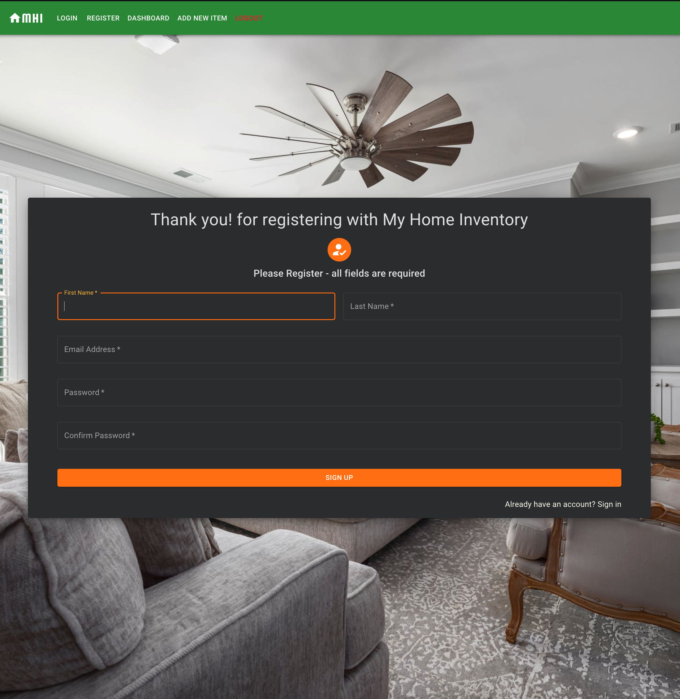
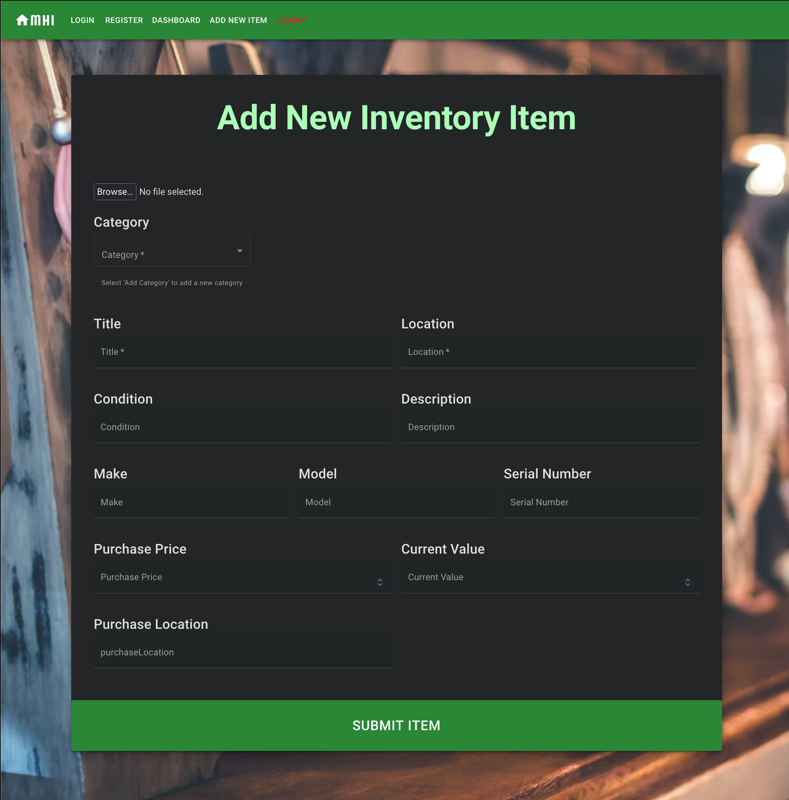
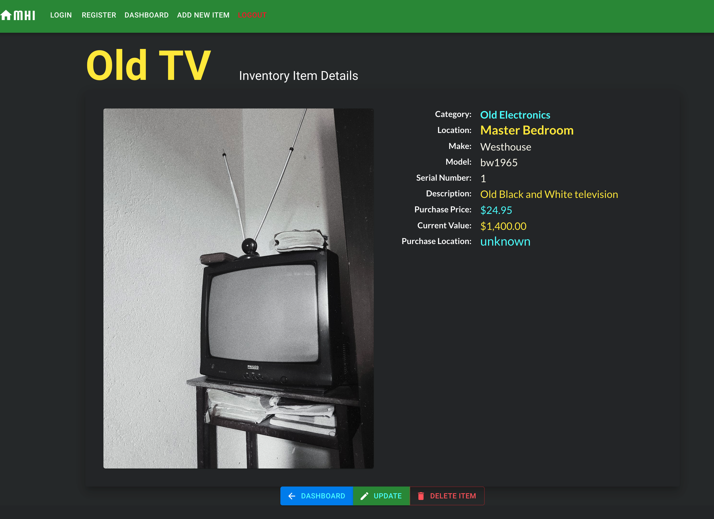
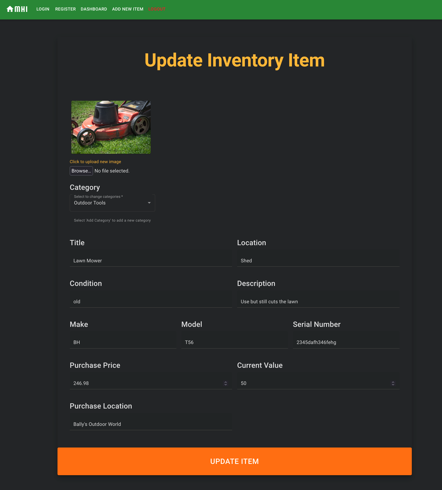

# My Home Inventory

## A Full Stack CRUD operating Web App using the MERN Stack
### User can register, login, and view all of the users inventory items stored in the database, 
### add new inventory item, including an image, and also update or delete item from the database

